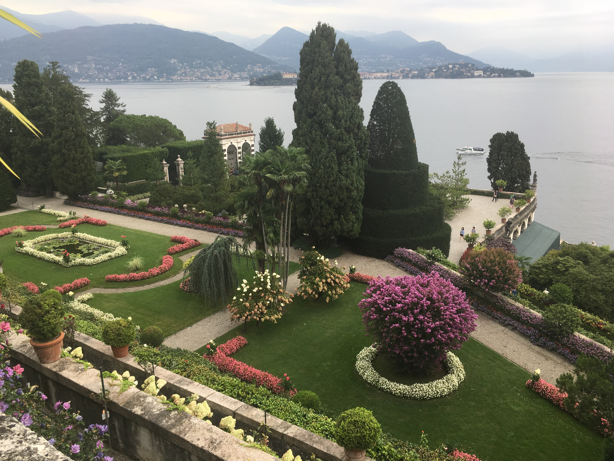

---
categories:
  - Others
tags:
  - travel
  - updates
title: "Ways to Include Images in Hugo"
date: "2017-10-01T19:36:35-07:00"
draft: false
---

What started out as an attempt to put together a travelogue turned into a rabbit hole about how best to store and reference images. There is some valuable [discussion](https://github.com/gohugoio/hugo/issues/3651) about where the topic may end up (who knows, maybe I'll learn Go and take a crack at it myself), but also details the methods that are currently being used to various effect. One other topic I wanted to explore is the *figure* shortcode, which supports a little more information than a simple markdown image, and is more flexible for use with a theme. Further note that I wanted to link to the full image, which in some cases, took even more wrangling.

## Figure, image in static

[](/img/travel/water-lilies.jpg)


[](/img/travel/water-lilies.jpg)


or





A couple observations here. First, at first glance, the figure title doesn't appear to be evaluated as Markdown, so using syntax like \*italicized\* doesn't work. Hopefully I can figure out how to do a second rendering pass without having to override the theme or figure shortcode.

Next, in order to get the above code example to work, I needed a way to escape shortcodes in order to keep them from evaluating. There is a kludgy, but working (if slightly undocumented) feature to do this that you can read about [here](https://discourse.gohugo.io/t/a-way-to-mark-plain-text-and-stop-hugo-from-interpreting/1325/2). One annoying issue with this method is that the formatting breaks highlighting in Sublime 3, with italics running through the end of the line.

Finally, we actually have two options for making the photo a link. If one uses the link field in the figure shortcode, the image itself is linked, but not the caption text. If you want the caption to link as well, you may wrap the entire shortcode in a Markdown link.

## Markdown, image in static





The advantage of this method is the relative simplicity without use of a shortcode, without much loss of information. Just make sure to include the first slash to avoid relative paths!

## Markdown, image in article folder





If you are interested in keeping image content with a given article (like I have done here), it makes sense to create a folder under posts rather than a single markdown file. Creating an "index.md" in that folder allows the slug with that folder name to behave just like a typical post, with the cost of slightly more organizational overhead. The result, however, is quite intuitive - the shortest style for including an image, with the added benefit of keeping the image close to the content itself (rather than being lost in /static/ where it could be forgotten).

Next time 'round, we'll talk about galleries, thumbnails and other ways to avoid serving huge images up front!
